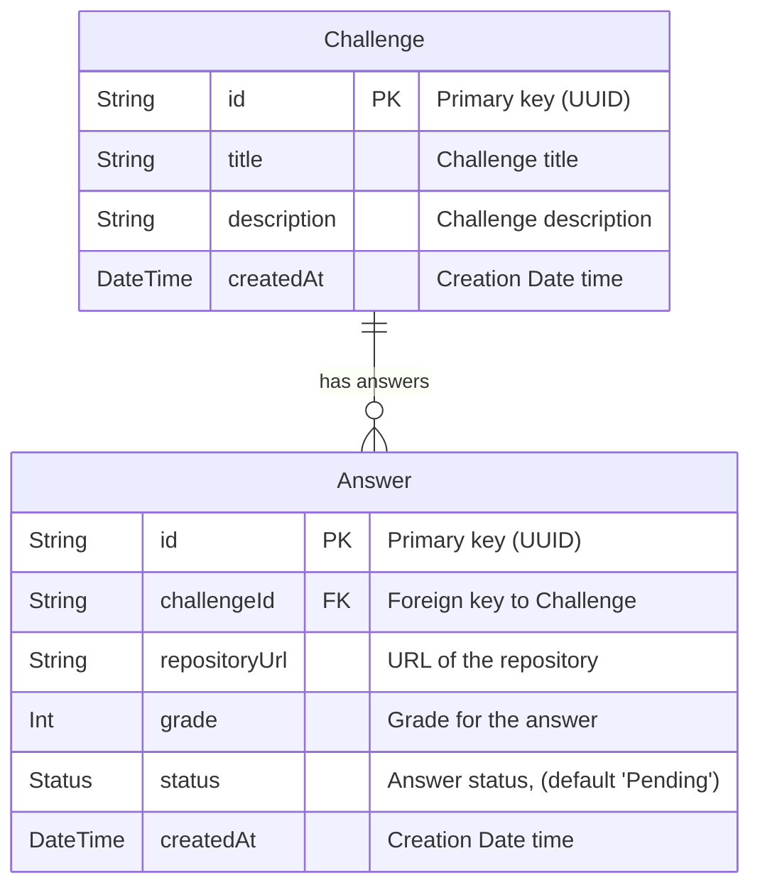
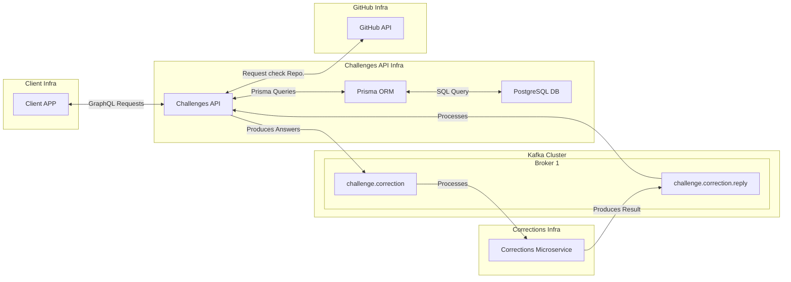

# Challenges API

This project is the implementation of a [Rocketseat backend challenge](https://github.com/Rocketseat/backend-challenge) a service that manages the challenges answers sent by the Rocketseat students.


## Index

- [Challenges API](#challenges-api)
  - [Index](#index)
  - [Technologies used](#technologies-used)
- [About the Project development](#about-the-project-development)
  - [Design](#design)
  - [Infrastructure](#infrastructure)
  - [Folders structure](#folders-structure)
  - [Layers](#layers)
  - [Requirements](#requirements)
    - [Functional Requirements](#functional-requirements)
    - [Business Requirements](#business-requirements)
    - [Non-Functional Requirements](#non-functional-requirements)
  - [GraphQL Routes](#graphql-routes)
- [Getting started](#getting-started)
  - [Node Version](#node-version)
  - [Installation](#installation)
    - [Challenges API dependencies](#challenges-api-dependencies)
    - [Corrections service dependencies](#corrections-service-dependencies)
  - [Configuring the PostgreSQL and Kafka](#configuring-the-postgresql-and-kafka)
  - [Configuring environmental variables](#configuring-environmental-variables)
  - [Running migrations](#running-migrations)
  - [Running the API](#running-the-api)
    - [Running Corrections Service](#running-corrections-service)
    - [Running Challenges API](#running-challenges-api)
  - [Test](#test)
    - [Unit test and Coverage](#unit-test-and-coverage)
  - [E2E Test](#e2e-test)

## Technologies used

- [NestJS](https://nestjs.com/): The framework used to develop the API.
- [Apache Kafka](https://kafka.apache.org/): The event streaming platform used here to provide the communication between this API and the Corrections service.
- [GraphQL](https://graphql.org/): A query language that can be used as alternative to REST pattern.
- [PrismaJS](https://www.prisma.io/): The ORM used to communicate with the PostgreSQL database. This ORM was used because it provides a type-safe query interaction with DB in an efficient and developer-friendly way.
- [Class Validator](https://www.npmjs.com/package/class-validator): To validate the requests data received by the API. It was used because has a good integration both with NestJS and GraphQL, so that the implementation becomes cleaner and maintainable.
- [Husky](https://github.com/typicode/husky): A tool that allows creating git hooks. It is used together with [commitlint](https://github.com/conventional-changelog/commitlint) to ensure the conventional commit pattern on every new commit made.

# About the Project development

## Design

The API was developed using DDD (Domain Driven Design). The main domain entities considered for this project where `Challenge` and `Answer`, each one with it's own specific attributes and operations. Also these two entities are related as "one to many", where one `Answer` is submitted to a unique `Challenge` and a `Challenge` can have zero or many answers.

<details>
<summary>Click to see the Entity Relation Diagram</summary>


</details>

`Node:` Of course that in a real scenario there might be many more entities here that can also be related to these two entities cited above. In wider scenario there might be entities like `Student` that can submit `Answers`, `Admin` which should be able to create new `Challenges`, and so on.

## Infrastructure

To have an abstract overview of the project infrastructure, see the diagram below:



## Folders structure

Based on these two main entities and DDD, the API internal architecture was organized in `modules` and `shared`.

- `src/modules`: Organize all domain entities (e.g. `challenge` and `answer`). Each domain holds all entities, services, resolvers, etc, related to this specific domain.
- `src/shared`: Organize all providers and resources that are shared between these domains.

Here is an example of how a domain module folder is organized in this project:

```text
domain/
├── infra/
│   ├── db/
│   │   ├── entities/
│   │   ├── mappers/
│   │   └── repositories/
│   ├── errors/
│   └── http/
│       ├── inputs/
│       ├── models/
│       └── resolvers/
├── repositories/
└── services/
```

This structure contributes for the project scalability and maintainability where each domain service can be developed in an isolated way without interfering to another domain service. Besides that it helps decrease the project complexity and ensure that each team can be focused in your own context.

## Layers

This project architecture was developed in layers. Considering from atomicity (low-level building blocks) to client communication (high-level interfaces) the project layers are:

| **Layer**                | **Key Components**                          | **Description**                                                                      |
| ------------------------ | ------------------------------------------- | ------------------------------------------------------------------------------------ |
| **Atomicity**            | Entities                                    | The most granular and fundamental part of the domain model.                          |
| **Data Translation**     | Mappers                                     | Convert between entities and persistence layers.                                     |
| **Persistence**          | Repositories                                | Abstract the database interaction.                                                   |
| **Business Logic**       | Services                                    | Encapsulate use cases and orchestrate domain logic.                                  |
| **Infrastructure**       | Kafka Messaging Provider, GitHub URL Helper | Handle cross-cutting concerns or external integrations.                              |
| **Client Communication** | Resolvers                                   | Interact with clients, exposing functionality via APIs (in this case, with GraphQL). |

## Requirements

This section explains how the requirements for the project where addressed.

- **Functional Requirements**
  - Should be able to create a `Challenge`
  - Should be able to remove a `Challenge`
  - Should be able to edit a `Challenge`
  - Should be able to list a `Challenge`
  - Should be able to send a `Answer` to a `Challenge`
  - Should be able to list `Answers`

- **Business Requirements**
  - The `Answer` must be registered with status "Pending"
  - The `Answer` should be registered with status "Error" if the related `Challenge` does not exists.
  - The `Answer` should be registered with status "Error" if the repository URL of the `Answer` is not a GitHub repository.
  - After the `Answer` is registered with no errors, the corrections service must be notified.
  - When the corrections service returns the correction result of an `Answer`, this `Answer` must be updated in database with the new **status** and **grade**.

- **Non-Functional Requirements**
  - The `Challenge` listing should filter by **title** and **description** and paginate it.
  - The `Answer` listing should filter by **challenge**, **date interval** and **status** and paginate it.
  - The database must be PostgreSQL.
  - The messaging service should be Apache Kafka.
  - Should use GraphQL as request query language.
  - It would be good to use NestJS to build the API.
  - It would be good to use Custom Scalar Types.

### Functional Requirements

In order to address the functional requirements the API was developed by creating one specific `repository`, `service` and `resolver` to each CRUD operation needed and also organizing it to the corresponding domain which this operation is related to. This also relates to the Single Responsibility Principle from SOLID. 

So here are some examples of services from each domain:


- `Challenge`
  - `CreateChallengeService` - Creates a new Challenge and persist in database by calling the database provider.
  - `DeleteChallengeService` - Deletes a registered Challenge by calling the database provider. 
  - `UpdateChallengeService` - Updates an already registered Challenge by calling the database provider.
  - `ListChallengeService` - Lists the Challenges registered in the DB, also allows to filter by `title`, and `description`.
- `Answer`
  - `AnswerChallengeService` - Creates a new answer and register it in database by calling the database provider.
  - `ListAnswersService` - Lists the answers registered in the DB, also allows to filter by `challengeId`, date interval and `status`.
  - `SubmitAnswerToCorrectionService` - Submits an already registered answer to the correction microservice.
  - `UpdateAnswerService` - Updates the `grade` and `status` of an answer. This service is called as a callback after the corrections microservice returns a correction result.

`Important Decisions/Choices`:

**CASCADE on delete Challenge**
- In Prisma Schema the `CASCADE` option was turned on, so when deleting a Challenge, all Answers related to it will be deleted too. Depending on the project specific needs, might be interesting to keep the Challenge registered in database and just set a new attribute to inform that this registry is deleted/archived. This second option can be used if we want to keep the answers saved and use them as a history of answers even if the Challenge "doesn't exist" anymore.

**UpdateAnswerService as a callback**
- The `UpdateAnswerService` is sent as a callback for the `SubmitAnswerToCorrectionService` by the `AnswerChallengeResolver`, so that the `SubmitAnswerToCorrectionService` doesn't need to know much about what is the service that will update the answer after receiving the correction response, it just receive a callback and execute it. It was built this way to decouple the dependency between the two services and maintain the consistency.

**Answers list returning also challenge titles**
- The Answers returned in `ListAnswersService` also returns the challenge title for each answer, this was done by creating a Prisma query in the `PrismaAnswersRepository` that joins the two tables and already returns also the challenge title for the answers listing. I added this feature so that the client can print also from which challenge this answer is from without needing to make another request.

**GitHub URL validation Rate Limiting**
- It was created a [GitHubUrlHelper](./src/shared/resources/helpers/github-url.helper.ts) to handle the Answer's repository URL validation. This helper validates the URL structure and also consults the GitHub website to verify if this repository really exists. There is no rate limiting for consulting the public repository webpage, but if requests are made too frequently the GitHub might temporarily block the IP and the request will fail. On the other hand, the rate limiting for consulting the repository through GitHub API without access token is `60 tries`, and the rate limiting for consulting a public repository through the GitHub API using a access token as Bearer token is `5000 tries`. For this project I decided to use both of them, first try to consult the repository by requesting the public webpage, if it fails, verify the repository through the GitHub API as a fallback. 
- Also I used `fetch` instead of `axios` (that can be clearer in some cases) because this is the only part that the project calls another API and doesn't need to handle response data. As `fetch` is lighter than `axios`, I preferred to use the `fetch` in this case.

### Business Requirements

**Answer default attributes**

- All the `Answer` default attributes are handled by the entity itself, for example, the `id`, `status`, `grade` and `createdAt` when creating a new `Answer` are set to respectively a random UUID, `status` "Pending", `grade` as `null` and `createdAt` as the current Date. I chose the `grade` to be `null` at beginning because at the `Answer` creation there is no `grade` value yet, so it's better to define `grade` as `null` and later calculate the grade at corrections service and update the `Answer`.

**Repository URL verification**

- The repository URL verification is done by calling the `GitHubUrlHelper` cited in the last section.

**Submitting Answer Correction**

- To be able to notify the corrections service, a shared interface `MessagingProvider` was created using the `KafkaMessagingProvider` as implementation, this provider is used by the `SubmitAnswerToCorrectionService` to emit the answer to the correction service, and the `SubmitAnswerToCorrectionService` is used inside the `AnswerChallengeResolver` that calls this service right after calling the `AnswerChallengeService` which creates a new `Answer`.

### Non-Functional Requirements

**Listing Answers and Challenges**

- To list both the `Answer` and `Challenge` registries, I used the Prisma query. The full JSON response object returned by these listing routes is similar to:

```json
{
  "page": 1,
  "limit": 10,
  "orderBy": "asc",
  "total": 20,
  "data": [
    //...
  ]
}
```

All filters could be done only with the Prisma query object, but besides that I also needed to calculate the `total`, and by default, it is not possible yet to include the `total` in Prisma `.findMany` query only by calling `.count` as another call. There are three ways to do that:
1. Making two different DB requests, first finding the registries (with pagination and filter) and then another call to count all the registries.
2. Making two different DB requests but sending via `$transaction`, in this case the two requests are sent to Prisma, then the Prisma executes the two requests and returns the both result.
3. Create a raw query to include the total inside the SQL result.

The fastest option is creating a raw query, for sure, but then we give up from clean code and might also compromise future maintainability. The second fast way is by using the `$transaction` because we keep using the Prisma friendly query and send it as a DB transaction, so I chose this option.

**Custom Scalar Types**

I also used Custom Scalar Type to automatically transform the `Date` field between the API and Client GraphQL requests. When the client sends the `Date` as ISO String the GraphQL checks all the Date fields and transform to `Date` type, on the other hand, when the API sends data to the Client, the GraphQL identify all `Date` fields and transform them to ISO String.

## GraphQL Routes

All Challenges and Answers routes returns by default the data inside a `{ data }` object, so that they can follow the same pattern as the listing routes that needs to respond with `data` (search result) and other attributes as `total` and `page`. Here are all Challenges and Answers routes:

```graphql
type Query {
  listChallenges(listChallengesData: ListChallengesInput!): ChallengesListResponseDataModel!
  listAnswers(listAnswersData: ListAnswersInput!): AnswersListResponseDataModel!
}

type Mutation {
  createChallenge(newChallengeData: CreateChallengeInput!): ChallengeResponseDataModel!
  updateChallenge(updateChallengeData: UpdateChallengeInput!): ChallengeResponseDataModel!
  deleteChallenge(deleteChallengeData: DeleteChallengeInput!): ChallengeResponseDataModel!
  answerChallenge(answerChallengeData: AnswerChallengeInput!): AnswerResponseDataModel!
}
```

There is also a `heartbeat` route just to check if the API is running:

```graphql
type Query {
  heartbeat: String!
}
```

The complete GraphQL schema is generated in the root folder after starting the API as `./schema.gql`, you will also be able to access the GraphQL routes documentation on the playground `http://localhost:3333/graphql`.

---

# Getting started 

This project uses `yarn` as its package manager, so the commands provided below are based on `yarn`. If you prefer to use a different package manager, please replace the commands with their equivalent for your chosen tool.

## Node Version

Before continue, certify that you are using a Node version `>=20.x.x`.

## Installation

### Challenges API dependencies

To install the dependencies of this API, just type:

```bash
$ yarn
```

This will also configure the `husky` and `commitlint` in your local repository, so that on every commit it will validate if the commit message is in accordance with Conventional Commit and also will execute the Unit tests.

### Corrections service dependencies

In another terminal access the `packages/corrections` folder.

```bash
$ cd packages/corrections
```

Then install the dependencies:

```bash
$ yarn
```

## Configuring the PostgreSQL and Kafka

Before executing any of the services, you must configure and run the PostgreSQL, Zookeeper and Kafka. For that there is a [Docker](https://docs.docker.com/desktop/setup/install/windows-install/) image, so to run all of them you can use docker compose. In the project root, run:

```bash
docker compose up -d
```

Make sure that all three services are up and running before jumping to the next section.

## Configuring environmental variables

Now you will need to create a `.env` (use `.env.example` as reference) file inside the project root folder and insert the following keys:

```env
# DATABASE
DATABASE_URL=

# GITHUB
GITHUB_ACCESS_TOKEN=
```

- `DATABASE_URL`: is the PostgreSQL database url for the API to be able to access the database, e.g. `postgresql://<username>:<password>@localhost:5432/<database>?schema=public`
- `GITHUB_ACCESS_TOKEN`: is the [GitHub access token](https://docs.github.com/en/authentication/keeping-your-account-and-data-secure/managing-your-personal-access-tokens) used to call the GitHub API to validate the repository URL. Create your access token (`Tokens (classic)`), give `public_repo` permission and paste it in this variable.

## Running migrations

Now you have the database running, you can execute the migrations to create the database in PostgreSQL:

```bash
npx prisma migrate dev
```

you can also run the command below to avoid executing the seed script and creating predefined registries in your DB:

```bash
npx prisma migrate dev --skip-seed
```


## Running the API

### Running Corrections Service

Before running the Challenges API you must run the Corrections Service. Inside the corrections service folder execute any of these commands based on the environment:

```bash
# development
$ yarn start

# watch mode
$ yarn start:dev

# production mode
$ yarn start:prod
```

You will be able to access the GraphQL playground at `http://localhost:3333/graphql`.

### Running Challenges API

Here are the three ways you can run the API based on the environment.

```bash
# development
$ yarn start

# watch mode
$ yarn start:dev

# production mode
$ yarn start:prod
```

## Test

### Unit test and Coverage

To run the automatic tests of the Challenges API run:

```bash
# unit tests
$ yarn test

# test coverage
$ yarn test:cov
```

## E2E Test

Before running the e2e test, you must run the Kafka broker container specific for testing. To do that you can run:

```bash
docker compose -f docker-compose.test.yml up -d
```
`Node`: About the database, a new testing schema is created in the PostgreSQL database on every test suite and deleted after the test is finished.

Then, if the new Kafka and Zookeeper containers are up and running, you can run the e2e tests:

```bash
# e2e tests
yarn test:e2e
```