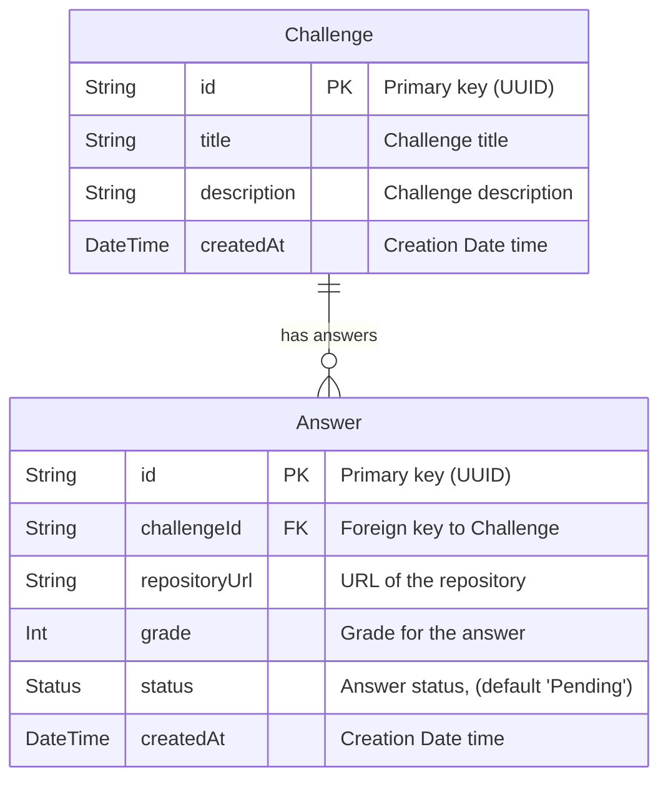

# Challenges API

This project is the implementation of a [Rocketseat backend challenge](https://github.com/Rocketseat/backend-challenge) a service that manages the challenges answers sent by the Rocketseat students.

## Technologies used

- [NestJS](https://nestjs.com/): The framework used to develop the API.
- [Apache Kafka](https://kafka.apache.org/): The event streaming platform used here to provide the communication between this API and the Corrections service.
- [GraphQL](https://graphql.org/): A query language that can be used as alternative to REST pattern.
- [PrismaJS](https://www.prisma.io/): The ORM used to communicate with the PostgreSQL database. This ORM was used because it provides a type-safe query interaction with DB in an efficient and developer-friendly way.
- [Class Validator](https://www.npmjs.com/package/class-validator): To validate the requests data received by the API. It was used because has a good integration both with NestJS and GraphQL, so that the implementation becomes cleaner and maintainable.
- [Husky](https://github.com/typicode/husky): A tool that allows creating git hooks. It is used together with [commitlint](https://github.com/conventional-changelog/commitlint) to ensure the conventional commit pattern on every new commit made.

# About the Project development

## Design

The API was developed using DDD (Domain Driven Design). The main domain entities considered for this project where `Challenge` and `Answer`, each one with it's own specific attributes and operations. Also these two entities are related as "one to many", where one `Answer` is submitted to a unique `Challenge` and a `Challenge` can have zero or many answers.

<details>
<summary>Click to see the Entity Relation Diagram</summary>


</details>

`Node:` Of course that in a real scenario there might be many more entities here that can also be related to these two entities cited above. In wider scenario there might be entities like `Student` that can submit `Answers`, `Admin` which should be able to create new `Challenges`, and so on.

## Folders structure

Based on these two main entities and DDD, the API internal architecture was organized in `modules` and `shared`.

- `src/modules`: Organize all domain entities (e.g. `challenge` and `answer`). Each domain holds all entities, services, resolvers, etc, related to this specific domain.
- `src/shared`: Organize all providers and resources that are shared between these domains.

Here is an example of how a domain module folder is organized in this project:

```text
domain/
├── infra/
│   ├── db/
│   │   ├── entities/
│   │   ├── mappers/
│   │   └── repositories/
│   ├── errors/
│   └── http/
│       ├── inputs/
│       ├── models/
│       └── resolvers/
├── repositories/
└── services/
```

This structure contributes for the project scalability and maintainability where each domain service can be developed in an isolated way without interfering to another domain service. Besides that it helps decrease the project complexity and ensure that each team can be focused in your own context.

## Requirements

This section explains how the requirements for the project where addressed.

- **Functional Requirements**
  - Should be able to create a `Challenge`
  - Should be able to remove a `Challenge`
  - Should be able to edit a `Challenge`
  - Should be able to list a `Challenge`
  - Should be able to send a `Answer` to a `Challenge`
  - Should be able to list `Answers`

- **Business Requirements**
  - The `Answer` must be registered with status "Pending"
  - The `Answer` should be registered with status "Error" if the related `Challenge` does not exists.
  - The `Answer` should be registered with status "Error" if the repository URL of the `Answer` is not a GitHub repository.
  - After the `Answer` is registered, the corrections service must be notified.
  - When the corrections service returns the correction result of an `Answer`, this `Answer` must be updated with the new **status** and **grade**.

- **Non-Functional Requirements**
  - The `Challenge` listing should filter by **title** and **description** and paginate it.
  - The `Answer` listing should filter by **challenge**, **date interval** and **status** and paginate it.
  - The database must be PostgreSQL.
  - The messaging service should be Apache Kafka.
  - Should use GraphQL as request query language.
  - It would be good to use NestJS to build the API.
  - It would be good to use Custom Scalar Types.

# Getting started 

This project uses `yarn` as its package manager, so the commands provided below are based on `yarn`. If you prefer to use a different package manager, please replace the commands with their equivalent for your chosen tool.

## Installation

### Challenges API dependencies

To install the dependencies of this API, just type:

```bash
$ yarn
```

### Corrections service dependencies

In another terminal access the `packages/corrections` folder.

```bash
$ cd packages/corrections
```

Then install the dependencies:

```bash
$ yarn
```

## Configuring the PostgreSQL and Kafka

Before executing any of the services, you must configure and run the PostgreSQL, Zookeeper and Kafka. For that there is a [Docker](https://docs.docker.com/desktop/setup/install/windows-install/) image, so to run all of them you can use docker compose. In the project root, run:

```bash
docker compose up -d
```

Make sure that all three services are up and running before jumping to the next section.

## Running the API

### Running Corrections Service

Before running the Challenges API you must run the Corrections Service. Inside the corrections service folder execute any of these commands based on the environment:

```bash
# development
$ yarn start

# watch mode
$ yarn start:dev

# production mode
$ yarn start:prod
```

### Running Challenges API

Here are the three ways you can run the API based on the environment.

```bash
# development
$ yarn start

# watch mode
$ yarn start:dev

# production mode
$ yarn start:prod
```

## Test

To run the automatic tests of the Challenges API run:

```bash
# unit tests
$ yarn test

# e2e tests
$ yarn test:e2e

# test coverage
$ yarn test:cov
```